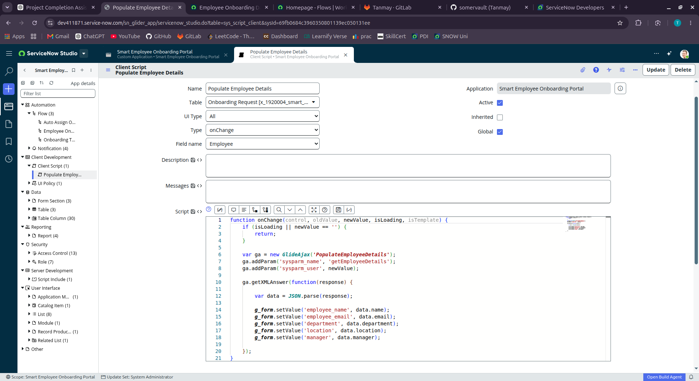
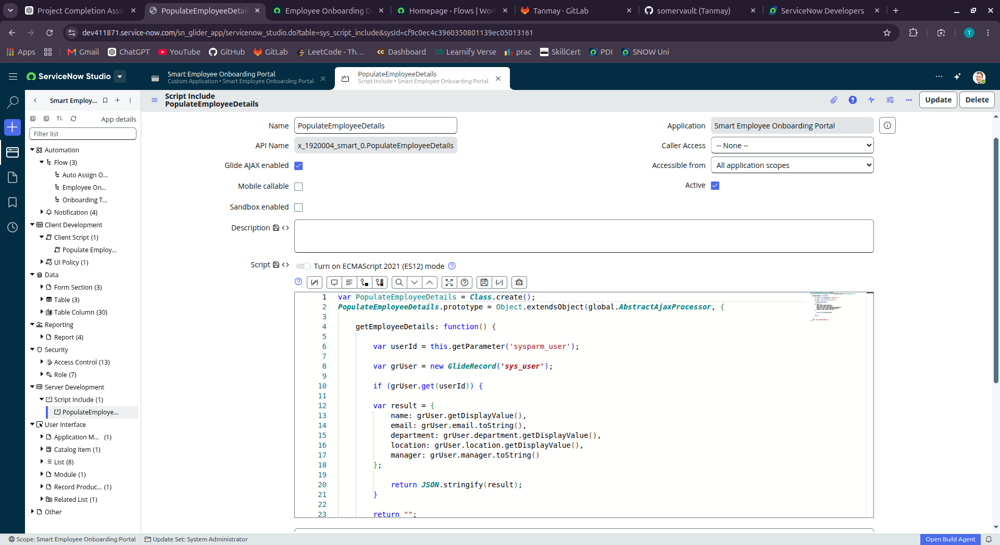
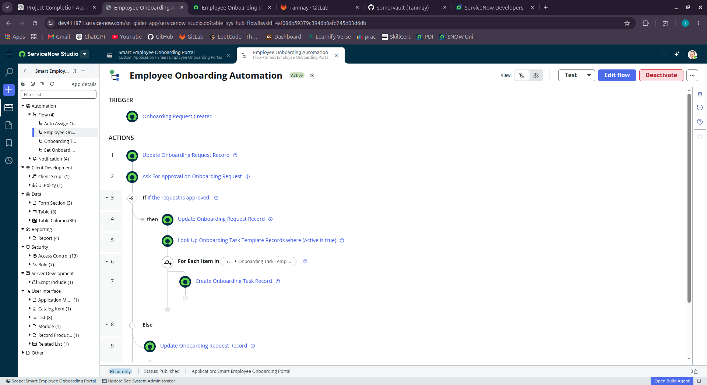
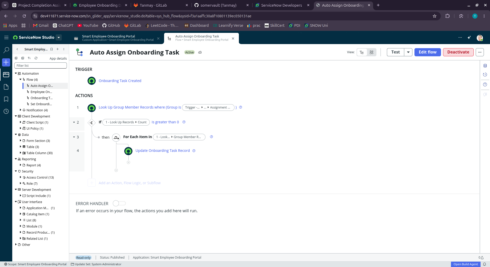
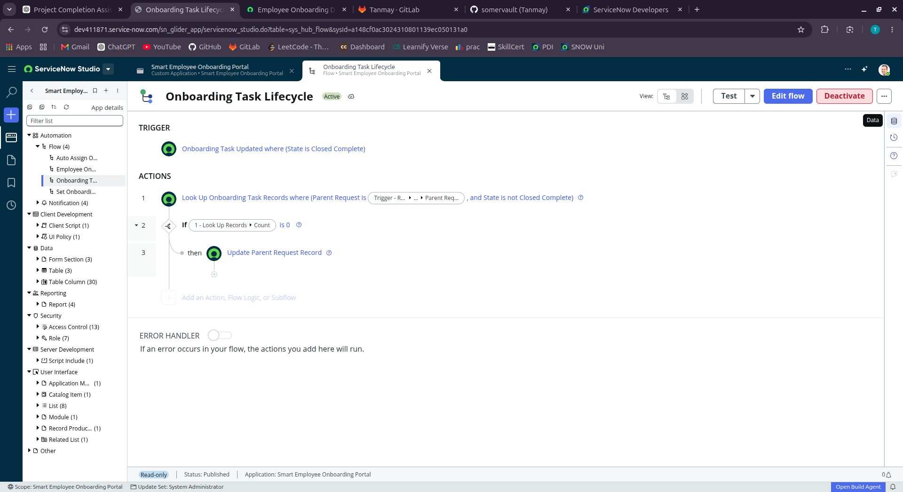
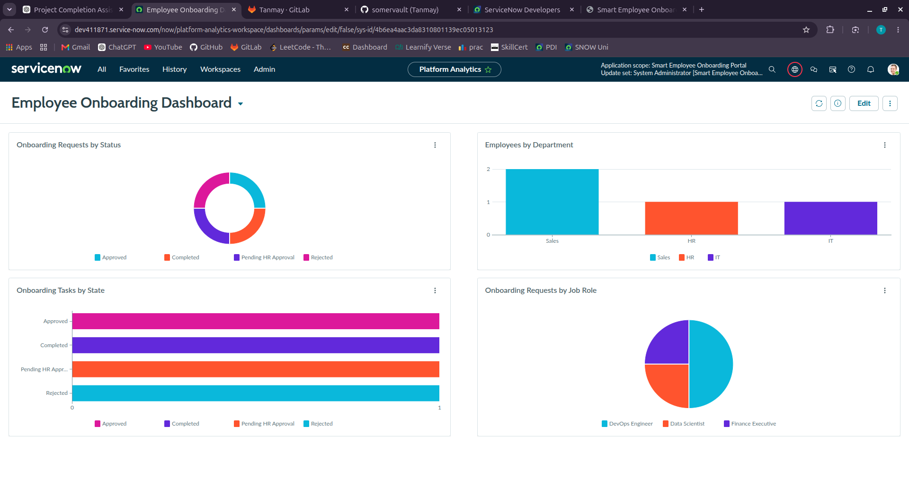
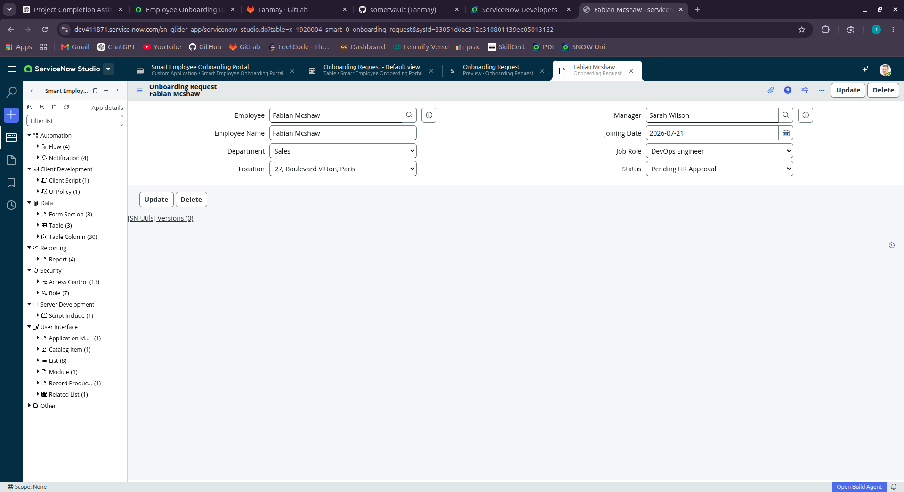

# 🚀 Smart Employee Onboarding Portal

> A complete end-to-end Employee Onboarding application built on the ServiceNow platform that automates the onboarding lifecycle using Flow Designer, Record Producers, Service Catalog, GlideAjax, Client Scripts, Script Includes, Reports, Dashboards, Notifications, and Role-Based Access Control.


---

# 📖 Overview

Employee onboarding is often handled manually through emails, spreadsheets, and multiple approval steps, resulting in delays, inconsistent task assignments, and limited visibility into onboarding progress.

The **Smart Employee Onboarding Portal** streamlines this process by automating the complete onboarding lifecycle.

Managers can submit onboarding requests through a Record Producer. Once approved, the application automatically generates onboarding tasks, assigns them to the appropriate teams, tracks task completion, updates request statuses, sends notifications, and provides real-time analytics through interactive dashboards.

---

# ✨ Key Features

- Custom Employee Onboarding Application
- Service Catalog Record Producer
- Custom Tables
- Variable Sets
- Role-Based Access Control (ACLs)
- Dynamic Client Scripts
- UI Policies
- Script Includes
- GlideAjax
- Flow Designer Automation
- HR Approval Workflow
- Automatic Onboarding Task Creation
- Automatic Task Assignment
- Parent Request Lifecycle Management
- Email Notifications
- Reports
- Interactive Dashboard

---

# 🏗️ System Architecture

```text
                           Employee / Manager
                                    │
                                    ▼
                      Employee Onboarding Record Producer
                                    │
                                    ▼
                        Onboarding Request Record
                                    │
                                    ▼
                   Employee Onboarding Automation Flow
                                    │
                    ┌───────────────┴────────────────┐
                    │                                │
                    ▼                                ▼
              HR Approval                     Request Rejected
                    │
                    ▼
         Lookup Active Task Templates
                    │
                    ▼
      Automatically Create Onboarding Tasks
                    │
                    ▼
         Auto Assign Tasks to Team Members
                    │
                    ▼
        Employees Complete Assigned Tasks
                    │
                    ▼
        Onboarding Task Lifecycle Flow
                    │
                    ▼
      Parent Request Automatically Completed
                    │
                    ▼
      Reports & Interactive Analytics Dashboard
```

---

# 📂 Project Structure

```text
Smart Employee Onboarding Portal
│
├── Automation
│   ├── Employee Onboarding Automation
│   ├── Auto Assign Onboarding Task
│   ├── Onboarding Task Lifecycle
│   └── Notifications
│
├── Client Development
│   ├── Client Script
│   └── UI Policy
│
├── Server Development
│   └── Script Include
│
├── Data
│   ├── Onboarding Request
│   ├── Onboarding Task
│   └── Onboarding Task Template
│
├── Security
│   ├── Roles
│   └── ACLs
│
├── Reporting
│   ├── Reports
│   └── Dashboard
│
└── Service Catalog
    ├── Record Producer
    └── Variable Sets
```

---

# 🗃️ Custom Tables

## 1. Onboarding Request

Stores the complete onboarding request submitted by managers.

### Fields

- Employee
- Employee Name
- Employee Email
- Department
- Location
- Manager
- Joining Date
- Job Role
- Status

---

## 2. Onboarding Task

Stores every onboarding task created for an employee.

Examples

- Laptop Setup
- Email Account Creation
- VPN Configuration
- ID Card Generation
- HR Documentation

Each task references its parent onboarding request.

---

## 3. Onboarding Task Template

Reusable templates used for automatic task generation.

Instead of hardcoding tasks inside flows, the application reads all active templates and dynamically creates onboarding tasks.

---

# 🔐 Security

## Roles

- Admin
- Manager
- User

## Access Control Lists

Custom ACLs secure all application records and ensure only authorized users can create, read, update, or delete onboarding information.

---

# 📋 Service Catalog

Created an Employee Onboarding Record Producer that acts as the primary entry point for managers to submit onboarding requests.

---

# 📦 Variable Sets

Reusable variable sets were created for future scalability.

- Employee Details
- Employment Details
- Asset Requirements
- Additional Information

---

# ⚙️ Dynamic Form Behaviour

## Department → Job Role Filtering

Implemented Catalog Client Scripts that dynamically update Job Role choices based on the selected department.

Departments include:

- IT
- HR
- Finance
- Sales
- Marketing
- Operations

Each department displays only relevant job roles.

---

## Laptop Requirement UI Policy

If

```
Laptop Required = Yes
```

Then

- Laptop Type becomes visible
- Laptop Type becomes mandatory

Otherwise the field is automatically hidden.

---

# 💻 Client Script + GlideAjax

A custom **onChange Client Script** was developed to automatically populate employee information when an employee is selected.

The Client Script:

- Calls a Script Include using GlideAjax
- Retrieves employee details
- Populates multiple fields automatically

Fields populated:

- Employee Name
- Employee Email
- Department
- Location
- Manager

### Screenshot



---

# 🖥️ Script Include

A reusable GlideAjax-enabled Script Include retrieves employee information from the **sys_user** table and returns JSON data to the client.

The Script Include returns:

- Name
- Email
- Department
- Location
- Manager

### Screenshot



---

# 🔄 Flow Designer Automation

## 1️⃣ Employee Onboarding Automation

This is the primary automation flow.

### Process

- Trigger when a new onboarding request is created.
- Update request status.
- Send approval request.
- Wait for HR approval.
- If approved:
  - Update status.
  - Lookup active onboarding task templates.
  - Automatically create onboarding tasks.
- If rejected:
  - Update request status to Rejected.
  - Send rejection notification.

### Screenshot



---

## 2️⃣ Auto Assign Onboarding Task

Automatically assigns newly created onboarding tasks.

Process:

- Trigger when task is created.
- Lookup assignment group members.
- Select an available member.
- Assign task automatically.

No manual assignment is required.

### Screenshot



---

## 3️⃣ Onboarding Task Lifecycle

Tracks completion of all onboarding tasks.

Whenever a task is closed:

- Lookup remaining tasks.
- If no pending tasks exist:
  - Automatically update parent onboarding request.
  - Set onboarding request status to **Completed**.

### Screenshot



---

# 📧 Notifications

Automated notifications are configured for important onboarding events.

Examples include:

- Approval Requests
- Approval Confirmation
- Request Rejection
- Onboarding Completion

---

# 📊 Reports

Four analytical reports were created.

## Onboarding Requests by Status

Displays request distribution by status.

- Approved
- Pending HR Approval
- Completed
- Rejected

---

## Employees by Department

Displays employee onboarding requests grouped by department.

---

## Onboarding Requests by Job Role

Shows onboarding distribution across job roles.

---

## Onboarding Tasks by State

Displays onboarding task progress.

---

# 📈 Interactive Dashboard

An interactive dashboard was created using Platform Analytics to provide real-time visibility into onboarding activities.

Dashboard includes:

- Onboarding Requests by Status
- Employees by Department
- Onboarding Requests by Job Role
- Onboarding Tasks by State

### Screenshot



---

# 📝 Onboarding Request Form

The onboarding request form automatically populates employee details and captures all required onboarding information.

### Screenshot



---

# 🛠️ Technologies Used

- ServiceNow Studio
- Flow Designer
- Service Catalog
- Record Producer
- Variable Sets
- Client Scripts
- UI Policies
- Script Includes
- GlideAjax
- Notifications
- Custom Tables
- Reports
- Platform Analytics Dashboard
- ACLs
- Roles

---

# 🎯 Skills Demonstrated

- ServiceNow Application Development
- Workflow Automation
- Flow Designer
- Service Catalog Development
- Record Producer Development
- Client-side Scripting
- Server-side Scripting
- GlideAjax
- Custom Tables
- Access Control
- Reporting
- Dashboard Development
- Process Automation

---

# 🚀 Future Enhancements

- Service Portal Integration
- Virtual Agent Support
- SLA Management
- IntegrationHub APIs
- HRSD Integration
- Document Generation
- Electronic Signature
- Employee Welcome Kit Automation
- AI-powered onboarding recommendations

---

# 📸 Screenshots

| Feature | Screenshot |
|----------|------------|
| Dashboard | `images/dashboard.png` |
| Onboarding Request Form | `images/onboarding-request-form.png` |
| Employee Onboarding Flow | `images/employee-onboarding-flow.png` |
| Auto Assign Flow | `images/auto-assign-flow.png` |
| Onboarding Task Lifecycle | `images/onboarding-task-lifecycle.png` |
| Client Script | `images/client-script.png` |
| Script Include | `images/script-include.png` |

---

# 👨‍💻 Author

**Tanmay Sawant**

B.Tech Computer Science Engineering

ServiceNow Certified System Administrator (CSA)

ServiceNow Certified Application Developer (CAD)

---

## ⭐ If you found this project interesting, consider giving it a star!
